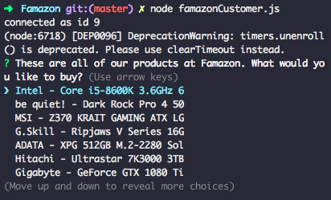
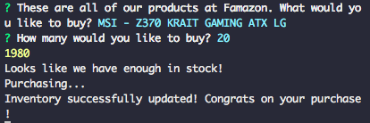
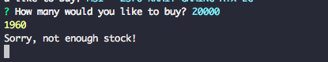
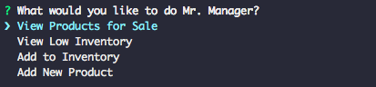
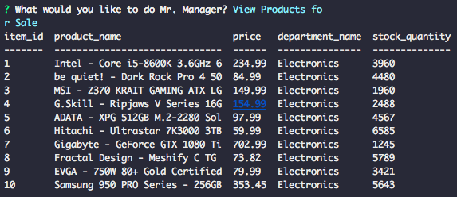
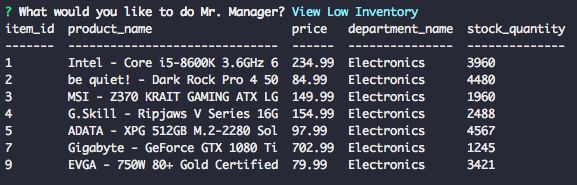
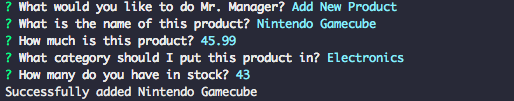

# Famazon 

#### RCB Ecommerce Assignment using MySQL and Node


## Famazon Customer 

The Famazon Customer interface allows you to view all of the products that Famazon has for sale as well as purchase a specific quantity. If enough of that particular product is in stock, it will allow you to purchase the product as well as update the current stock of that item in the database. If there is not enough stock, it will tell you so and not allow you to purchase the product. 

**Usage** - 

```
node famazonCustomer.js
```


#### Customer Product View 

On starting the app, you will be greeted to the list of products Famazon has for sale. 




#### Customer Purchase View 

Upon choosing an item, you will be asked how many of that particular item you would like to buy. 


#### Customer End View 

After denoting the quantity, it will "purchase" the item in the aforementioned quantity and update the inventory/stock in the database. 



If there is not enough stock of a particular item, it will show you the amount of stock plus tell you that there is not enough in inventory to fulfill the request. 




## Famazon Manager View 

The Famazon manager view allows you to do several actions concerning all the inventory in stock. 



`View all Products` - Allows you to view all products for sale, as well as their relevant information such as stock quantity and price. 



`View Low Invetory` - Allows you to view all the products with an inventory lower than 5000. 



`Add to Inventory` - Allows you to add to the stock of a certain product in inventory. 

`Add New Product` - Allows you to add a new product to the Inventory Database. 



`Exit Famazon Manager Portal` - Closes and end the program. 